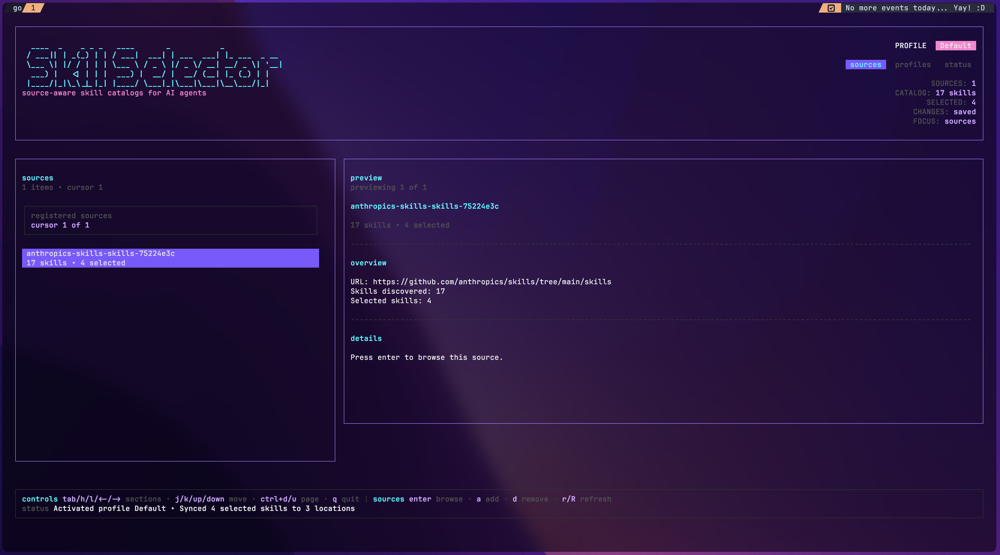

# Skill Selector

[](https://github.com/TheOneWithTheWrench/skill-selector/actions/workflows/ci.yml)
[](https://github.com/TheOneWithTheWrench/skill-selector/actions/workflows/release.yml)
[](https://github.com/TheOneWithTheWrench/skill-selector/releases)
[](https://go.dev/doc/devel/release)
[](https://goreportcard.com/report/github.com/TheOneWithTheWrench/skill-selector)

🧰 Skill Selector manages shared skills across supported coding agents from one place.

<p align="center">
  
</p>

## 🚀 Install

With Homebrew:

```bash
brew install TheOneWithTheWrench/tap/skill-selector
```

From this repo:

```bash
go install ./cmd/skill-selector
```

Run without installing:

```bash
go run ./cmd/skill-selector
```

If your Go bin directory is on `PATH`, the installed command is:

```bash
skill-selector
```

## 🔄 Quick Start

```bash
skill-selector source add https://github.com/anthropics/skills/tree/main/skills
skill-selector refresh
skill-selector
```

Tip:
- use a repo URL for broad best-effort discovery
- use a GitHub tree URL when you want precise control over exactly which folder gets scanned
- for large or oddly structured repos, tree URLs are the recommended path

## 🎛️ TUI

The TUI is the default interface:

```bash
skill-selector
```

You can also open it explicitly:

```bash
skill-selector tui
```

Main sections:
- `Sources` - add sources and drill into one source's skills
- `Catalog` - toggle skills for the active profile
- `Profiles` - create, rename, remove, and activate profiles
- `Status` - inspect runtime paths and current sync state

Draft changes stay in the TUI until you sync.

## 💻 CLI

Use the CLI when you want scripting, automation, or quick inspection.

```bash
# Sources
skill-selector source add https://github.com/anthropics/skills/tree/main/skills
skill-selector source add https://github.com/ComposioHQ/awesome-claude-skills
skill-selector source list
skill-selector source remove https://github.com/anthropics/skills/tree/main/skills
skill-selector source remove anthropics-skills-skills-75224e3c

# Refresh / catalog
skill-selector refresh
skill-selector pull
skill-selector catalog list

# Profiles
skill-selector profile list
skill-selector profile create reviewer
skill-selector profile rename reviewer backend-reviewer
skill-selector profile remove backend-reviewer
skill-selector profile switch reviewer

# Sync
skill-selector sync source-id:reviewer
skill-selector sync source-id:path/to/skill
skill-selector sync --all
skill-selector sync status
skill-selector sync clear
```

For the full command tree:

```bash
skill-selector --help
```

## 🧠 Mental Model

- `Source` - an upstream skill source, currently a GitHub repo or tree URL
- `Catalog` - the local inventory of discovered skills from refreshed sources
- `Profile` - a named saved selection of skills
- `Sync` - the real installed symlinks in agent skill directories

High-level flow:
1. add one or more sources
2. refresh to build the catalog
3. select skills into a profile
4. sync that profile into your agents

Important behavior:
- quitting the TUI drops unsynced draft changes
- activating a profile syncs that profile's saved selection into supported agents
- sync only manages files it owns; unrelated files in agent directories are left alone
- removing a source also removes that source's skills from saved profiles

## ✨ Supported Agents

- Ampcode
- Claude
- Codex
- Cursor
- Opencode

## 📁 Runtime Data

By default Skill Selector stores data in XDG-style paths:

- data: `~/.local/share/skill-selector`
- cache: `~/.cache/skill-selector`

That includes sources, profiles, sync manifests, and the local catalog cache.

## 🤝 Notes

- the CLI and TUI share the same core behavior
- the project keeps the core independent from Cobra and Bubble Tea
